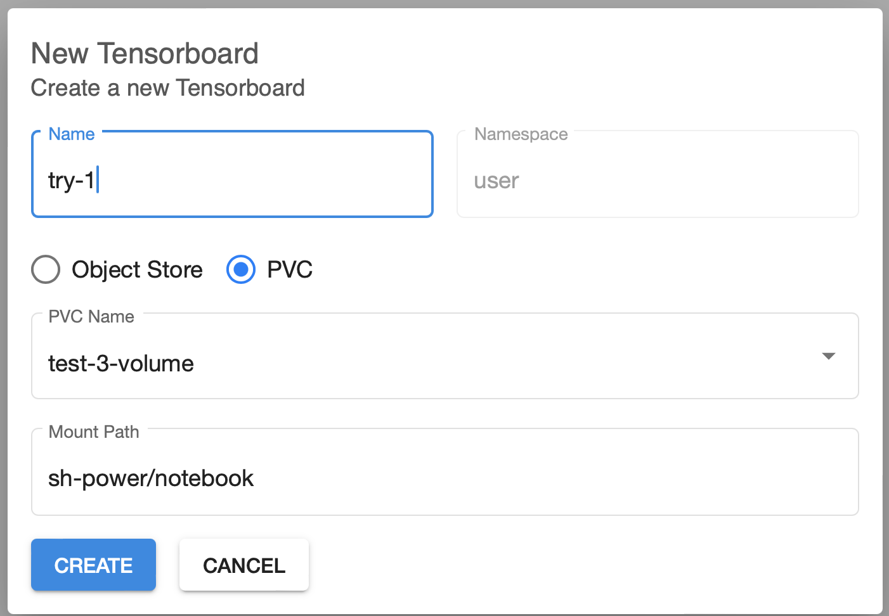
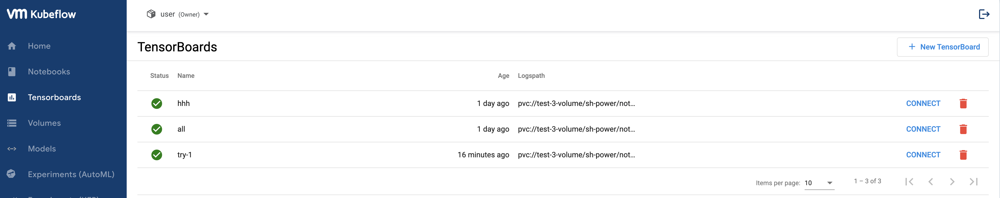
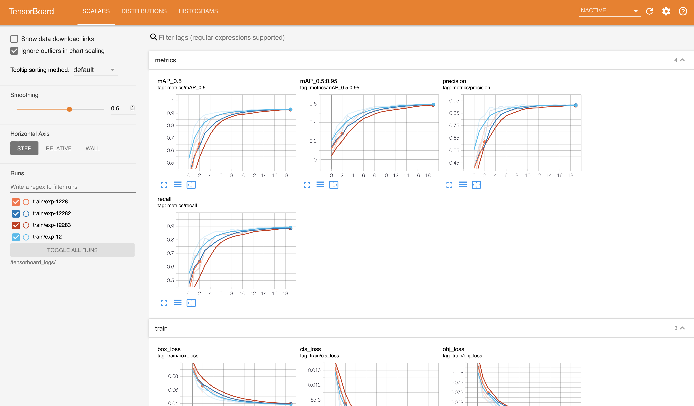

# Tensorboard

训练后，可以使用 Tensorboard，通过图形的方式，直观地观察训练的过程和结果，并比较各次训练。

通过下面的三张图，可以看到如何创建 Tensorboard 以及其呈现的效果。

**注意**：

- PVC Name 为该 notebook 的默认卷；
- Mount Path 开始于家目录下面的一级目录，结束于包含 `train.py` 脚本（或 `runs` 子目录）的目录。

